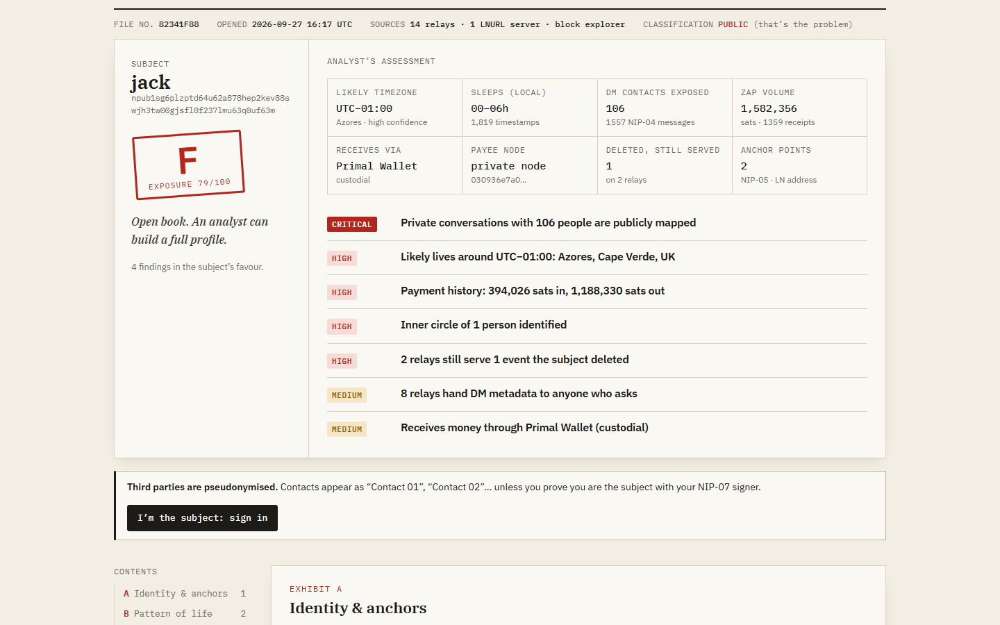
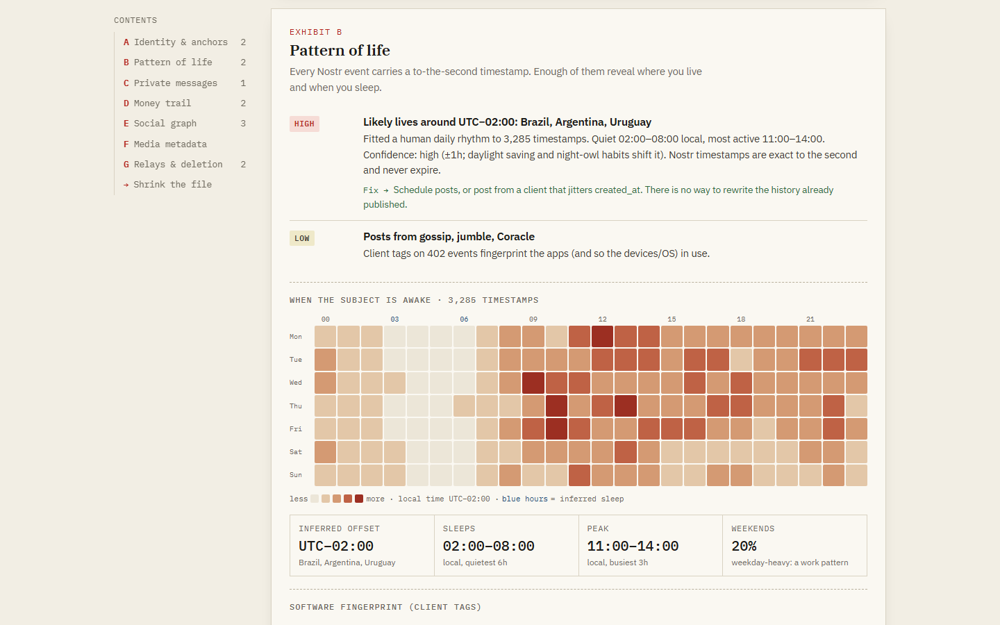
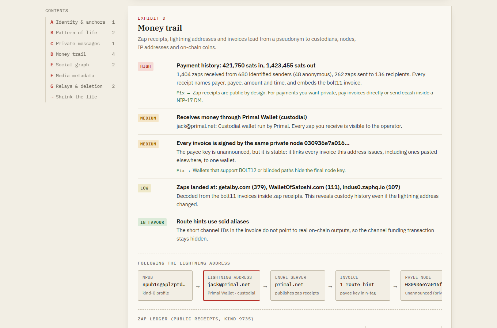

# Dossier

**See your npub the way a surveillance analyst does.**

Live: **https://satanrayshe.github.io/dossier/** · Demo video: https://youtu.be/fjHhKI4tsYQ

Paste a Nostr public key. Dossier reads public relays, the subject's lightning address and the Bitcoin block chain straight from your browser. From that it writes the file an analyst could build: where you probably live, when you sleep, who you DM, who pays you, which custodian holds your zaps, and which relays still serve the notes you deleted. Then it gives you one-click fixes, signed by your own NIP-07 extension.

No backend. No accounts. No analytics. The only network calls go to the sources you can see and configure.



## Why

Nostr and Bitcoin both keep a permanent, public record, and most people have never looked at their own. The data isn't hidden: NIP-04 DMs leave sender, recipient and timestamp in plaintext; zap receipts publish payer, payee and amount; and every event has a to-the-second timestamp. Chain-analysis firms and motivated individuals already put this together. Dossier puts it in front of the person it's about, before somebody else does.

## What's in the file

| Exhibit | What an analyst learns | How |
| --- | --- | --- |
| **A · Identity & anchors** | NIP-05 domain, website, NIP-39 linked accounts, older profile versions still served by some relays, other keys listed on the same NIP-05 domain (alts, colleagues) | kind 0 across ~20 relays, `/.well-known/nostr.json` with and without `?name=` |
| **B · Pattern of life** | Likely UTC offset and region, sleep window, busiest hours, weekday vs weekend habit, client fingerprint, geohash tags | Fits a human diurnal curve to thousands of `created_at` values (cross-correlation over 15-minute offsets) |
| **C · Private messages** | Who you talk to privately, how often, at what hour, since when. Which relays gave that metadata to a stranger and which demanded AUTH | Unauthenticated `kind:4` queries by author and `#p` |
| **D · Money trail** | Zap ledger in and out, top payers/payees, custodial provider, the node that signs your invoices (location, ISP, capacity), channel funding transactions leaked by route hints, custody history from old zap receipts, bitcoin addresses posted in notes | LNURL-pay resolution, BOLT-11 signature recovery, scid → block/tx/output lookup on a mempool.space-compatible API |
| **E · Social graph** | Inner circle: people who appear in private *and* public channels, as a link chart | DMs weighted ×4, zaps ×2, replies, follows |
| **F · Media** | GPS coordinates and camera model in photos, flagging content-addressed (Blossom) hosts that can't strip EXIF without changing the hash | First 192 KB of each image via a Range request, parsed with exifr |
| **G · Relays & deletion** | Which relays still serve events you deleted, split into "ignored the request they hold" vs "never got it" | Per-relay `ids` queries for every `e` tag in your kind-5 events |

Every finding gets a severity, and the file gets an exposure score (0–100, graded A–F).




## Shrinking the file

Signed by your NIP-07 extension (Alby, nos2x, Keys.band). The page never sees a private key.

- **Delete legacy DMs**: NIP-09 deletion requests (`kind:5`, `k=4`) for every kind-4 message you sent, batched 200 per event.
- **Publish a NIP-17 inbox**: `kind:10050` pointing at AUTH-only inbox relays, so contacts switch to gift-wrapped DMs.
- **Rebroadcast deletions**: pushes your *existing* signed kind-5 events to the relays that still serve deleted notes. No signature needed.
- **Delete leaky notes**: notes with posted addresses, geotags, GPS photos or phone numbers.
- **Scrub profile fields**: republish kind 0 without the fields you pick.

## Ethics: third parties stay pseudonymous

Dossier is a self-audit tool, but it works on any key, like a block explorer. Everyone who shows up in a subject's file (DM partners, payers, payees) appears as `Contact 01`, `Contact 02`, … Names are shown only after the viewer proves with NIP-07 that they *are* the subject. The subject's own data is shown to everyone, because it's already public and that's the point.

## Your OPSEC while using it

Opening a file connects from your IP to ~20 relays, the subject's LNURL server (an unpaid invoice request), image hosts, and the block explorer. Each of these can be turned off or pointed at your own infrastructure (your relay, your Umbrel's mempool) under **Sources & OPSEC settings**. For sensitive work, use Tor Browser.

The page ships a strict Content-Security-Policy (`script-src 'self'`, no third-party scripts, self-hosted fonts) and `no-referrer`.

## Run it

```bash
npm install
npm run dev      # http://localhost:5173
npm test         # vitest: BOLT-11 spec vector, timezone recovery, scanners, zap parsing
npm run build    # static site in dist/
```

The analysis runs in Node as well, which is handy for batch research:

```bash
npx tsx scripts/run.ts npub1...
```

## Layout

```
src/lib/relay.ts       one socket per relay, per-relay results (needed for deletion/DM-refusal checks), signature verification
src/lib/collect.ts     the investigation pipeline
src/lib/bolt11.ts      BOLT-11 decoder with payee recovery from the signature
src/lib/lightning.ts   LNURL, provider/custody detection, node lookup, scid → funding tx
src/lib/analyze.ts     timezone fit, DM contacts, zap ledger, inner circle, findings, score
src/lib/scan.ts        address/invoice/PII/image/geohash scanners
src/lib/media.ts       EXIF GPS reader
src/lib/remediate.ts   NIP-09 / NIP-17 / profile fixes via NIP-07
```

## Limits

- Timezone is ±1h and can be skewed by schedulers, bots, travel and night-owl habits. The file says how confident it is.
- Relays differ in what they keep, so two runs a minute apart can return slightly different counts. The coverage table shows which relay returned what.
- Deletion is a request. Honest relays comply; archives don't.
- Private zaps (NIP-57 appendix) and NIP-17 content are out of scope by design: Dossier only uses what a stranger can see.

Built for **BOSS Battle 2026** (Bitshala), Freedom Stack and Cypherpunk tracks.

MIT licensed.
